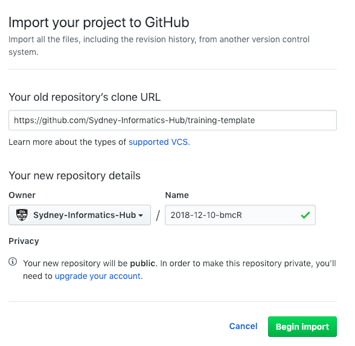

# SIH Training Course Template

**This template was last edited on 15.12.18**

This repo is a skeleton or template of SIH's Carpentries-based training course lesson and workshop landing page websites. Use this when creating or running a new training course for SIH.

## Step 0: What do you want?

Identify whether you want:
- to run a workshop and tell people where to go and what software to install beforehand
- to develop some new lesson materials
- to create a landing page for a series of courses, linking together multiple courses

All three of these types of websites can be made using this repository:
* `workshop` is probably the one you'll use most frequently, and allows you to create an event landing page. It is designed to promote an actual instance or set of trainings covering one of our lessons, for example the [GIS workshop in December 2018](https://sydney-informatics-hub.github.io/2018_12_10_GISworkshop/).
* `lesson` creates a series of pages which can be used to develop course materials, for example [Intro to Artemis](https://sydney-informatics-hub.github.io/training.artemis.introhpc/). These course materials will be reused and updated for multiple deliveries throughout the year(s).
* `series` is used as a landing/contents page for a group of lessons that form a theme, for example the [Artemis series](https://sydney-informatics-hub.github.io/training.artemis/).

Write down which of the three you want: `workshop`, `lesson`, or `series`.

[comment]: <All updates to course content can be made in the lesson repository, across multiple years and runnings of the course. Releases can be generated to snapshot specific versions of the lesson materials delivered on a specific day, meaning students can always access both the latest versions of the materials, and the historic one that was delivered when they came to the workshop. From a course developer perspective, we have a full history of all changes to the materials in one place.>
[comment]: <Being able to create both types of websites from one repository means we can keep things consistent between teams/courses, only having to edit in one place, AND if course materials are not to be made available publicly, you can still have a workshop landing page with setup instructions, survey links and a pretty schedule.>


All of these can be set up using the GitHub interface directly (by editing the files described below), or by downloading the entire project to your local machine and editing and previewing there.

Any website created from this repository will be rendered at `https://sydney-informatics-hub.github.io/yourreponame`.


## Step 1: Get this template


Make a copy of this **training-template** repository, which you will then edit to create your training course.

You can carry out this step on GitHub directly (Option 1), or by downloading this repository to your local machine (Option 2).

#### Option 1: Use GitHub's importer to copy this training-template repository.

1. Log in to the [public GitHub](https://github.com). (If you do not have an account, you can quickly create one for free.) You must be logged in for the remaining steps to work.

2. Go to [GitHub's importer](https://github.com/new/import).

3. Paste the url of this repo as the old repository to clone: https://github.com/Sydney-Informatics-Hub/training-template.

4. Select the owner for your new repository. This will be `Sydney-Informatics-Hub`.

5. <a name="choosename">Choose a name for your website repository</a>:

    - If you are creating a <u>workshop website</u>, this name should have the form YYYY-MM-DD-\<workshopID>, where YYYY-MM-DD is the start date of the workshop, and workshopID is a human readable label for others to understand which workshop this could be referring to. For example, 2018-11-28-bmcR or 2018-12-12-IntroArtemis.
    - If you are creating a <u>lesson website</u>, the name should have the form: lesson-\<series>-\<course>, for example *lesson-bmc-introR*.
    - If you are creating a <u>series website</u>, the name should have the form: \<series>, for example *training-artemis*.


6. Make sure the repository is public.

7. At this point, you should have a page like this:



You can now click `Begin Import`. When the process is done, you will receive a message like "Importing complete! Your new repository "Sydney-Informatics-Hub/2018-12-10-bmcR" is ready." and you can go to the new repository by clicking on the name. Proceed to Step 2 below.

#### Option 2: Command line local option

### i. Copy this template

Make a new directory where you want to keep your local copy of the course repo, and initialise it as a git repository. See step 5

```
mkdir /training-course-name
cd !$ && git init
```

Now add the template repository as a remote, calling it **template**

```
git remote add template https://github.com/Sydney-Informatics-Hub/training-template.git
```

Finally, fetch and checkout the template

```
git fetch template gh-pages
git checkout -b gh-pages template/gh-pages
```

You will now have a skeleton of the course website, ready for editing. The template repo will be available as a remote repository, should you wish to update the template files later on.

### ii. Create a course repo on Sydney-Informatics-Hub

Go to the Sydney Informatics Hub [external git site](https://github.com/Sydney-Informatics-Hub) (this site!), and create a new repository

<p align="center">

</p>

Make sure **Sydney-Informatics-Hub** and not your personal account is the owner. See [above](#choosename) to figure out what the correct name for your repository should be (something like lesson-artemis-introhpc for a lesson, and 2019-01-20-introhpc for a workshop).


<p align="center">

</p>

Keep the repo **public** and do _not_ include a README.

Once the repo has been created on Sydney-Informatics-Hub, return to your local clone of the **template** and execute these commands to add this new GitHub repo as a remote, and then ```push -u``` to it

```
git remote add origin https://github.com/Sydney-Informatics-Hub/yourreponame.git
git push -u origin gh-pages
```

Finally, add the **Training** Team to the repo, so that all members will be able to edit it. Go to the **Settings** tab at top right of the repo page on GitHub.com, and select _Collaborators & teams_ from the nav menu on the left. Then select _Add a team_:

<p align="center">

</p>


<br>

## Step 2: Making the website

### i. Editing the template

#### a. Settings
Before you being to edit content, there are a number of **settings** you need to change first:

1.  In the file **_config.yml**
    - Set a **port** for your local rendering of your website (if using, see below). You may be developing multiple lessons at the same time, and if you'd like to render more than one at once, then you should assigning them different port numbers. When  **jekyll** renders your website, it will display in your web-browser at the address ```localhost:<port>```. Leave as is if you're working on this in GitHub.
    - If this is an SIH-developed lesson or workshop, set **carpentry** to be `"si"`; if it's a partnership one select `"sp"`. If you do not wish to use the SIH branding, but want to keep a Carpentries brand for a course or workshop, then set the **carpentry** variable to `"swc"`, `"dc"`, `"lc"`, or `"cp"` as appropriate.
    - Edit the **title** and **series_name** of your course. If it is a one-off course not part of a series, then simply set this to "Home".
    - Set the **kind** of course to `workshop` or `lesson` or `series`
    - If the course is part of a _series_, then set the **series_home** address to link to the series' page. Eg https://sydney-informatics-hub.github.io/training.artemis/ is the address of the _Artemis_ series (Using the new naming standard, though, it should be https://sydney-informatics-hub.github.io/training-artemis/).
    - Set `"yes"` in the **SETUP** section for each of the tools that students will need to have on their machines prior to the workshop, and ``"no"`` if they don't need a particular tool. If you need a different tool(s), ask Darya or follow the instructions here FIXME to add it to the template.

2.  The template includes a **setup.md** file that explains how to prepare your computer to connect to Artemis HPC, the Uni's compute cluster. You may need this information for your lesson; if not, adapt as required. FIXME - this REALLY NEEDS TO BE FIXED

3.  The **index.md** file is the homepage of your course.
    - If this project is a `lesson` then a syllabus table will be automatically generated for you, containing the episodes in the lesson and an expected timeline.


#### b. <a name="workshop">(Option 1) Making a new workshop site<a>

The homepage for your site is **index.md**, so be sure to include relevant information there. We've set it up so that the default format for the repo is to make a workshop site.

1. Venue should be set to University of Sydney for most events; for other parameters, see the comments in **index.md**. You don't need to edit anything below the yaml header.

2. Depending on the type of "carpentry" you're running (usually `"si"` or `"sp"`), you will need to edit the syllabus and schedule, and perhaps the attendee info and introduction as well. These are written in html, and located (for `si`, for example) in:

    - \_includes/si/intro.html
    - \_includes/si/schedule.html    
    - \_includes/si/syllabus.html
    - \_includes/si/who.html

#### b. (Option 2) Making a new lesson

The default website generated from this repository is set to be a workshop, so if you want to make a `lesson` website instead, you'll need to rename some files. First,

1. Rename **index.md** to hidden file **.workshop_index.md** and rename hidden file **.lesson_index.md** to **index.md**.


2. Edit the contents of this page, as it will be the landing page for your course material.  
    - If this project is a member of a series, include that information in the **Follow-on courses** paragraph. Else delete this.

Lesson sections are called "_episodes_" and can be created in two distinct ways:
- As markdown pages, in which case they are created and edited in the **\_episodes** subfolder. These can be created and edited directly on GitHub pages, so if you're developing everything online this is the folder to use.
- as Rmarkdown pages, in which case they are stored in the **_episodes_rmd** subfolder. These can then be rendered as markdown into the **\_episodes** folder automatically, by running `make lesson-md` from the root directory of the repo. This will overwrite any preexisting files in **\_episodes**, so be careful!


The template includes:
  - one _episode_ (**01-FIXME.md**) and one _break_ (**02-break.md**) page, stored in the **\_episodes** folder. You can use these to start developing your lesson materials in markdown.
  - one *episode* (**01-FIXME.Rmd**) and one *break* (**02-break.Rmd**) in **\_episodes_rmd** folder. FIXME need to make these files!


Irrespective of which of the two approaches you choose, lesson pages will be generated in filename order, so name them 01_, 02_, etc.
  - Pay attention to the _frontmatter_ of the lesson files:
    ```YAML
    ---
    title: "FIXME"
    teaching: 20
    exercises: 0
    questions:
    - "FIXME"
    objectives:
    - "FIXME"
    keypoints:
    - "FIXME"
    ---
    ```

These lines are essential. At minimum, any pages you want rendered will need to begin with two lines of ```---```; the lines enclosed by these triple-dashes are [YAML][yaml] variable declarations.

Make sure to estimate the **time** you expect the lesson components will take. This will automatically be displayed on the landing page of your lesson.

**Figures** may be kept in the ```fig``` subfolder. There are other folders for various content as well.

#### b. (Option 3) Making a new series

The default website generated from this repository is set to be a workshop, so if you want to make a `series` website instead, you'll need to rename some files. First,

1. Rename **index.md** to hidden file **.workshop_index.md** and rename hidden file **.lesson_index.md** to **index.md** (no, this is not a typo: the lesson file is used to make both lesson and series pages)

2. Edit the contents of this **index.md** file, as it will be the landing page for your series.

- Replace the **Follow-on courses** paragraph with an table listing each course and it's description, eg (in Markdown code)
```Markdown
| Lesson  | Overview |
| ------- | ---------- |
| [Course 1]({{ site.sih_pages }}/lesson-<series>-<course1>) | Description 1 |
| [Course 2]({{ site.sih_pages }}/lesson-<series>-<course2>) | Description 2 |
```


<hr>

 <i> If you were working directly on GitHub, you are done! You can now get a coffee and wait 5-15 minutes for the website to render on GitHub pages, and then come back to fix/debug.</i>
<hr>

### ii. (Optional) Setting up Jekyll to render your lesson website locally

You will want to set up Jekyll so that you can preview changes on your own machine before pushing them to GitHub. To do this you must install the software described below. (Julian Thilo's instructions for [installing Jekyll on Windows][jekyll-windows].)

1.  **Ruby**.
    This is included with Linux and macOS;
    the simplest option on Windows is to use [RubyInstaller][ruby-installer].
    Make sure Ruby is upto date otherwise jekyll may fail.
    You can test your installation by running `ruby --version`.
    For more information,
    see [the Ruby installation guidelines][ruby-install-guide].

2.  **[RubyGems][rubygems]**
    (the package manager for Ruby).
    You can test your installation by running `gem --version`.

3.  **[Jekyll][jekyll]**.
    You can install this by running `gem install jekyll`.
    On macOS, a user does not have a permission to write to `/Library/Ruby/Gems/`.
    Run `gem install jekyll --user-install` instead.

4.  **R Packages**.
    We use [knitr][cran-knitr], [stringr][cran-stringr], and [checkpoint][cran-checkpoint]
    to format lessons written in R Markdown,
    so you will need to install these to build R lessons
    (and this example lesson). The best way to install these packages is to open an R terminal and type:

    ```
    > install.packages('knitr', repos = 'https://', dependencies = TRUE)
    > install.packages('stringr', repos = 'https://cran.rstudio.com', dependencies = TRUE)
    > install.packages('checkpoint', repos = 'https://cran.rstudio.com', dependencies = TRUE)
    > install.packages('ggplot2', repos = 'https://cran.rstudio.com', dependencies = TRUE)
    ```

Once all of these are installed, you will probably need to run
```
bundle install
```
to ensure all required Ruby Gems are installed. Perhaps add a ```bundle update``` too for good measure!

### iii. (Optional) Checking that your site conforms to the Carpentries style

The Carpentries template comes with some checking scripts.

Running ```make lesson-fixme``` will list all instances of the phrase **FIXME** remianing in your code base.

Running ```make lesson-check``` will do the above, and report on various different departures from the Carpentries style, or possible errors
  * The following errors can be ignored:
  ```
  Missing required file ./_extras/discuss.md
  Missing required file ./_extras/guide.md
  ./_config.yml: configuration carpentry value sih is not in ('swc', 'dc', 'lc', 'cp')
  ```
  If you want to include the **discussion** or **guide** pages, then unhide them (remove the ```.``` from the front of their filenames) in the **\_extras** folder and add the content you desire.

  * The following style warnings may also be ignored
    - ```Unknown or missing blockquote type None``` occurs when you use a ```> block quote``` environment that is not one of the special types in the Carpentries style

### iv. Updating the template (Optional but very welcome)

This **template** may be updated from time to time. If you ever wish or need to incorporate such updates into your customised course websites, you do so by _pulling_ in the changes from the **template** repo into your **course** repo.

You will need to pay careful attention to the merge process to ensure that none of your content is overwritten by the update. You will probably want to have a graphical Git-enabled editor or _diff_ tool to let you easily see and approve/reject any merge conflicts.

If you **created your course repo from the template originally**, as in these instructions, then the changes you have made should take precedence, and there should be few problems.

However, new _content_ may be added to the template -- such additions will always include the phrase **"FIXME"**, so make sure to search for these in your repo. (Running ```make lesson-fixme``` in your repo directory will find any remaining "FIXME"s in your files).

At your local copy

```
git pull template gh-pages
```


## Contributing

We welcome all contributions to improve our courses, and to create new ones. Maintainers will do their best to help if you have any questions, concerns, or experience any difficulties along the way.

We'd like to ask you to familiarise yourself with our [Contribution Guide](CONTRIBUTING.md) and have a look at
The Carpentries' [detailed guidelines][lesson-example] before jumping in.

This document will attempt to outline the process for creating or substantially editing a training course website.

**If you simply wish to make small edits or suggestions to an existing course, this is not the repo you're looking for!** To do that, please add an issue under the corresponding lesson's material.

<p align="center">

</p>

<br>

## Maintainer(s)

* Darya Vanichkina
* Hayim Dar
* Nathaniel Butterworth
* Tracy Chew

Contact [sih.training@sydney.edu.au](mailto:sih.training@sydney.edu.au).


[lesson-example]: https://carpentries.github.io/lesson-example
[cc-by-human]: https://creativecommons.org/licenses/by/4.0/
[cc-by-legal]: https://creativecommons.org/licenses/by/4.0/legalcode
[osi]: https://opensource.org
[mit-license]: https://opensource.org/licenses/mit-license.html

[coc]: https://docs.carpentries.org/topic_folders/policies/code-of-conduct.html
[contrib-covenant]: https://contributor-covenant.org/
[contributing]: blob/gh-pages/CONTRIBUTING.md
[styles]: https://github.com/carpentries/styles/

[cran-checkpoint]: https://cran.r-project.org/package=checkpoint
[cran-knitr]: https://cran.r-project.org/package=knitr
[cran-stringr]: https://cran.r-project.org/package=stringr

[jekyll-collection]: https://jekyllrb.com/docs/collections/
[jekyll-install]: https://jekyllrb.com/docs/installation/
[jekyll-windows]: http://jekyll-windows.juthilo.com/
[jekyll]: https://jekyllrb.com/
[jupyter]: https://jupyter.org/

[kramdown]: https://kramdown.gettalong.org/
[pandoc]: https://pandoc.org/
[pyyaml]: https://pypi.python.org/pypi/PyYAML
[r-markdown]: https://rmarkdown.rstudio.com/

[rstudio]: https://www.rstudio.com/
[ruby-install-guide]: https://www.ruby-lang.org/en/downloads/
[ruby-installer]: https://rubyinstaller.org/
[rubygems]: https://rubygems.org/pages/download/
[yaml]: http://yaml.org/
