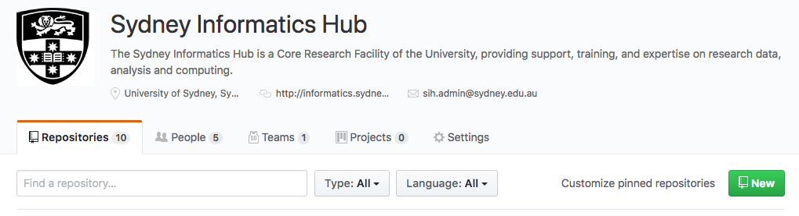
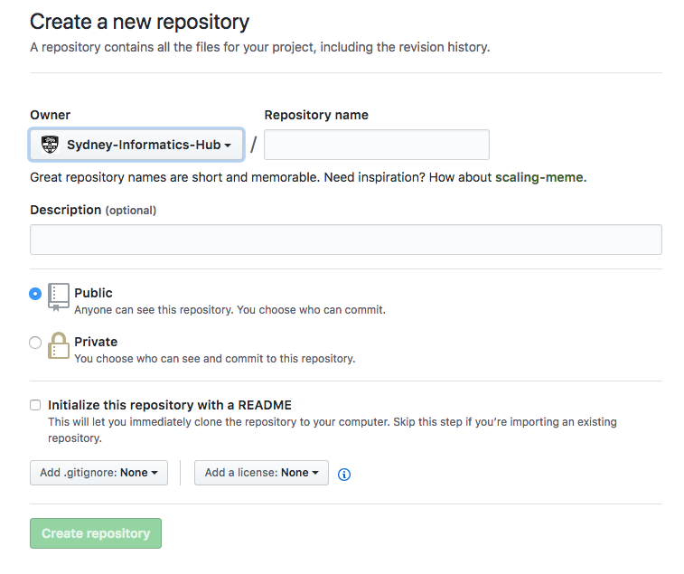
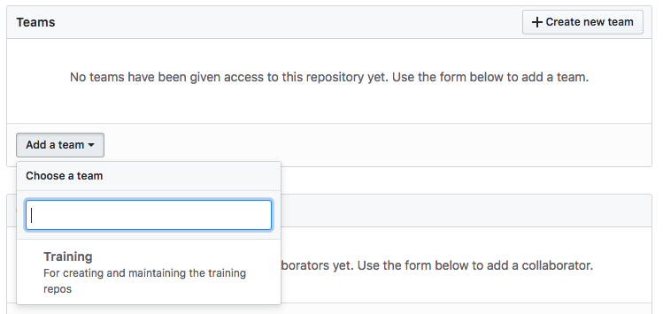

# Artemis Training Course Template

**This template was last edited on 22.11.18**

This repo is a skeleton or template of SIH's Carpentries-based training course websites. Use this when creating a new training course for SIH.

## Contributing

We welcome all contributions to improve our courses, and to create new ones. Maintainers will do their best to help if you have any questions, concerns, or experience any difficulties along the way.

We'd like to ask you to familiarise yourself with our [Contribution Guide](CONTRIBUTING.md) and have a look at
The Carpentries' [detailed guidelines][lesson-example] before jumping in.

This document will attempt to outline the process for creating or subtantially editing a training course website.

**If you simply wish to make small edits or suggestions to an existing course, this is not the repo you're looking for!**

<p align="center">

</p>

<br>

## Step 1: Getting this template

### i. Clone the **training.template** repo

The first step is to make a copy of the **training.template** repository, which you will then edit to create your training course.

Make a new directory where you want to keep your local copy of the course repo, and initialise it as a git repository:

```
mkdir /training.course.name

cd !$ && git init
```

Now add the template repository as a remote, calling it **template**

```
git remote add template https://github.com/Sydney-Informatics-Hub/training.template.git
```

Finally, pull in the template

```
git fetch template gh-pages
git checkout -b gh-pages template/gh-pages
```

You will now have a skeleton of the course website, ready for editing. The template repo will be available as a remote repository, should you wish to update the template files later on.

### ii. Create a course repo on Sydney-Informatics-Hub

Go to the Sydney Informatics Hub [external git site](https://github.com/Sydney-Informatics-Hub) (this site!), and create a new repository

<p align="center">

</p>

Make sure **Sydney-Informatics-Hub** and not your personal account is the owner. Name the repo whatever you wish, but I suggest keeping to a convention following **training.\<series\>.\<course\>**, eg *training.artemis.introhpc*.

<p align="center">

</p>

Keep the repo **public** and do _not_ include a README.

Once the repo has been created on Sydney-Informatics-Hub, return to your local clone of the **template** and execute these commands to add this new GitHub repo as a remote, and then ```push -u``` to it

```
git remote add origin https://github.com/Sydney-Informatics-Hub/training.<series>.<course>.git
git push -u origin gh-pages
```

Finally, add the **Training** Team to the repo, so that all members will be able to edit it. Go to the **Settings** tab at top right of the repo page on GitHub.com, and select _Collaborators & teams_ from the nav menu on the left. Then select _Add a team_:

<p align="center">

</p>


<br>

## Step 2: Writing a course

### i. Editing the template

First, familiarise yourself with the [Contribution Guide](CONTRIBUTING.md) and have a look at The Carpentries' [lesson example and guidelines][lesson-example] on Carpentries-style lesson formatting.

#### a. Settings
Before you being to edit content, there are a number of **settings** you need to change first:

1.  In the file **_config.yml**
    - Set a **port** for your local rendering of your website (see below). You may be developing multiple lessons at the same time, and if you;d like to render more than one at once, then you should assing them different port numbers. When **jekyll** renders your website, it will display in your web-browser at the address ```localhost:<port>```.
    - Edit the **title** and **series_name** of your course. If it is one off course not part of a series, then simply set this to "Home".
    - Set the **kind** of course to "workshop" or "lesson" or "series":
      * _lesson_ is the regular course page (See [Intro to Artemis](https://sydney-informatics-hub.github.io/training.artemis/) for an exmaple)
      * _series_ is used as a landing/contents page for a group of lessons that form a theme. (See [Artemis series](https://sydney-informatics-hub.github.io/training.artemis/) for an example)
      * _workshop_ is an event page to promote an actual instance or set of trainings covering these lessons. (See [GIS Workshop](https://sydney-informatics-hub.github.io/2018_12_10_GISworkshop/) for an example).
        1. If you are developing a workshop page, rename **index.md** to hidden file **.lesson_index.md** and rename hidden file **.workshop_index.md** to **index.md**. 
        2. See **_Making a Workshop site_** below.
    - If the course is part of a _series_, then set the **series_home** address to link to the series' page. Eg https://sydney-informatics-hub.github.io/training.artemis/ is the address of the _Artemis_ series.
    - (If you do not wish to use the SIH branding, but want to keep a Carpentries brand for a course or workshop, then set the **carpentry** variable to "swc", "dc", "lc", or "cp" as desired).
   
2.  The template includes a **setup.md** file that explains how to prepare your computer to connect to Artemis HPC, the Uni's compute cluster. You may need this information for your lesson; if not, adapt as required.

3.  The **index.md** file is the homepage of your course.
    - If this project is _not_ of type _series_ then a syllabus table will be automatically generated for you, containing the episodes in the lesson and an expected timeline.
    - If this project is a member of a series, include that information in the **Follow-on courses** paragraph. Else delete this.
    - If this project _is_ a series page, then replace the **Follow-on courses** paragraph with an table listing each course and it's decription, eg (in Markdown code)
    ```Markdown
    | Lesson  | Overview |
    | ------- | ---------- |
    | [Course 1]({{ site.sih_pages }}/training.<series>.<course1>) | Descrption 1 |
    | [Course 2]({{ site.sih_pages }}/training.<series>.<course2>) | Descrption 2 |
    ```
  
#### b. Content

The homepage for your site is **index.md**, so be sure to include relevant information there.

Lesson sections are called "_episodes_" and are pages created in the **\_episodes** subfolder.

The template also includes one _episode_ (**01-FIXME.md**) and one _break_ (**02-break.md**) page, stored in the **\_episodes** folder. This is wherethe content of your lessons should go. Familiarise yourself with the Carpentries' [lesson example and guidelines][lesson-example] before you begin editing!

  - Lessons will be generated in filename order, so name them 01_, 02_, etc.
  - Pay attention to the _frontmatter_ of the lesson files:
    ```YAML
    ---
    title: "FIXME"
    teaching: 20
    exercises: 0
    questions:
    - "FIXME"
    objectives:
    - "FIXME"
    keypoints:
    - "FIXME"
    ---
    ```
    
    These lines are essential. At minimum, any pages you want rendered will need to begin with two lines of ```---```; the lines enclosed by these triple-dashes are [YAML][yaml] variable declarations.
    Make sure to estimate the **times** you expect the lesson components will take.

**Figures** may be kept in the ```fig``` subfolder. There are other folders for various content as well.


#### c. Making a Workshop site

> Darya please explain..!

### ii. Setting up Jekyll to render your lesson website locally

You will want to set up Jekyll so that you can preview changes on your own machine before pushing them to GitHub. To do this you must install the software described below. (Julian Thilo's instructions for [installing Jekyll on Windows][jekyll-windows].)

1.  **Ruby**.
    This is included with Linux and macOS;
    the simplest option on Windows is to use [RubyInstaller][ruby-installer].
    Make sure Ruby is upto date otherwise jekyll may fail.
    You can test your installation by running `ruby --version`.
    For more information,
    see [the Ruby installation guidelines][ruby-install-guide].

2.  **[RubyGems][rubygems]**
    (the package manager for Ruby).
    You can test your installation by running `gem --version`.

3.  **[Jekyll][jekyll]**.
    You can install this by running `gem install jekyll`.
    On macOS, a user does not have a permission to write to `/Library/Ruby/Gems/`.
    Run `gem install jekyll --user-install` instead.

4.  **R Packages**.
    We use [knitr][cran-knitr], [stringr][cran-stringr], and [checkpoint][cran-checkpoint]
    to format lessons written in R Markdown,
    so you will need to install these to build R lessons
    (and this example lesson). The best way to install these packages is to open an R terminal and type:

    ```
    > install.packages('knitr', repos = 'https://', dependencies = TRUE)
    > install.packages('stringr', repos = 'https://cran.rstudio.com', dependencies = TRUE)
    > install.packages('checkpoint', repos = 'https://cran.rstudio.com', dependencies = TRUE)
    > install.packages('ggplot2', repos = 'https://cran.rstudio.com', dependencies = TRUE)
    ```

Once all of these are installed, you will probably need to run 
```
bundle install
```
to ensure all required Ruby Gems are installed. Perhaps add a ```bundle update``` too for good measure!

### iii. Checking that your site conforms to the Carpentries style

The Carpentries template comes with some checking scripts.

Running ```make lesson-fixme``` will list all instances of the phrase **FIXME** remianing in your code base. 

Running ```make lesson-check``` will do the above, and report on various different departures from the Carpentries style, or possible errors
  * The following errors can be ignored:
  ```
  Missing required file ./_extras/discuss.md
  Missing required file ./_extras/guide.md
  ./_config.yml: configuration carpentry value sih is not in ('swc', 'dc', 'lc', 'cp')
  ```
  If you want to include the **discussion** or **guide** pages, then unhide them (remove the ```.``` from the front of their filenames) in the **\_extras** folder and add the content you desire.
  
  * The following style warnings may also be ignored
    - ```Unknown or missing blockquote type None``` occurs when you use a ```> block quote``` environment that is not one of the special types in the Carpentries style

### (iv. Updating the template)

This **template** may be updated from time to time. If you ever wish or need to incorporate such updates into your customised course websites, you do so by _pulling_ in the changes from the **template** repo into your **course** repo.

You will need to pay careful attention to the merge process to ensure that none of your content is overwritten by the update. You will probably want to have a graphical Git-enabled editor or _diff_ tool to let you easily see and approve/reject any merge conflicts. 

If you **created your course repo from the template originally**, as in these instructions, then the changes you have made should take precedence, and there should be few problems.

However, new _content_ may be added to the template -- such additions will always include the phrase **"FIXME"**, so make sure to search for these in your repo. (Running ```make lesson-fixme``` in your repo directory will find any remaining "FIXME"s in your files).

At your local copy

```
git pull template gh-pages
```


## Maintainer(s)

* Darya Vanichkina
* Hayim Dar
* Nathaniel Butterworth
* Tracy Chew

Contact [sih.training@sydney.edu.au](mailto:sih.training@sydney.edu.au).


[lesson-example]: https://carpentries.github.io/lesson-example
[cc-by-human]: https://creativecommons.org/licenses/by/4.0/
[cc-by-legal]: https://creativecommons.org/licenses/by/4.0/legalcode
[osi]: https://opensource.org
[mit-license]: https://opensource.org/licenses/mit-license.html

[coc]: https://docs.carpentries.org/topic_folders/policies/code-of-conduct.html
[contrib-covenant]: https://contributor-covenant.org/
[contributing]: blob/gh-pages/CONTRIBUTING.md
[styles]: https://github.com/carpentries/styles/

[cran-checkpoint]: https://cran.r-project.org/package=checkpoint
[cran-knitr]: https://cran.r-project.org/package=knitr
[cran-stringr]: https://cran.r-project.org/package=stringr

[jekyll-collection]: https://jekyllrb.com/docs/collections/
[jekyll-install]: https://jekyllrb.com/docs/installation/
[jekyll-windows]: http://jekyll-windows.juthilo.com/
[jekyll]: https://jekyllrb.com/
[jupyter]: https://jupyter.org/

[kramdown]: https://kramdown.gettalong.org/
[pandoc]: https://pandoc.org/
[pyyaml]: https://pypi.python.org/pypi/PyYAML
[r-markdown]: https://rmarkdown.rstudio.com/

[rstudio]: https://www.rstudio.com/
[ruby-install-guide]: https://www.ruby-lang.org/en/downloads/
[ruby-installer]: https://rubyinstaller.org/
[rubygems]: https://rubygems.org/pages/download/
[yaml]: http://yaml.org/
