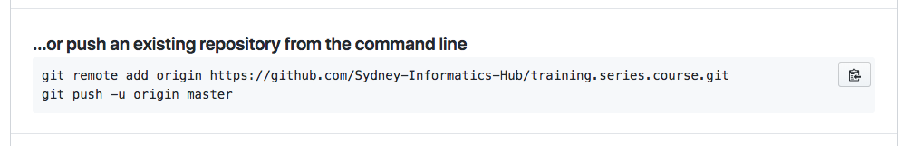

# Artemis Training Course Template

## How to use

### 1. Clone the **training.template** repo

The first step is to make a copy of the **training.template** repository, which you will then edit to create your training course.

Make a new directory where you want to keep your local copy of the course repo, and initialise it as a git repository:

```
mkdir /training.course.name && cd !$

git init
```

Now add the template repository as a remote, calling it **template**

```
git remote add template https://github.com/Sydney-Informatics-Hub/training.template.git
```

Finally, pull in the template

```
git pull template gh-pages
```

You will now have a skeleton of the course website, ready for editing. The template repo will be available as a remote repository, should you wish to update the template files later on.

### 2. Create a course repo on Sydney-Informatics-Hub

Go to the Sydney Informatics Hub [external git site](https://github.com/Sydney-Informatics-Hub) (this site!), and create a new repository

<p align="center">

</p>

Make sure **Sydney-Informatics-Hub** and not your personal account is the owner. Name the repo whatever you wish, but I suggest keeping to a convention following **training.<series>.<course>**, eg **training.artemis.introhpc**.

<p align="center">

</p>

Keep the repo **public** and do _not_ include a README.

Once the repo has been created on Sydney-Informatics-Hub, return to your local clone of the **template** and execute the commands shown to add this new GitHub repo as a remote, and then ```push -u``` to it

<p align="center">

</p>

```
git remote add origin https://github.com/Sydney-Informatics-Hub/training.<series>.<course>.git
git push -u origin master
```

Finally, add the **Training** Team to the repo, so that all members will be able to edit it. Go to the **Settings** tab at top right, and select _Collaborators & teams_ from the nav menu on the left:

<p align="center">

</p>

## Contributing

We welcome all contributions to improve our courses. Maintainers will do their best to help if you have any
questions, concerns, or experience any difficulties along the way.

We'd like to ask you to familiarise yourself with our [Contribution Guide](CONTRIBUTING.md) and have a look at
The Carpentries' [detailed guidelines][lesson-example] on proper formatting, ways to render the lesson locally, and how to write new episodes.

## Maintainer(s)

* Darya Vanichkina
* Hayim Dar
* Nathaniel Butterworth
* Tracy Chew

Contact [sih.training@sydney.edu.au](mailto:sih.training@sydney.edu.au).


[lesson-example]: https://carpentries.github.io/lesson-example
