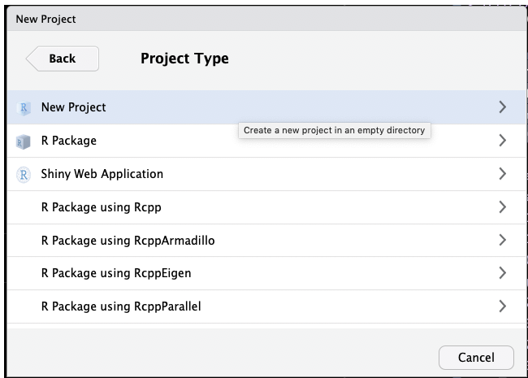

---
# Please do not edit this file directly; it is auto generated.
# Instead, please edit 06-CounttableToR.md in _episodes_rmd/
title: "Loading a count table into R"
author: "Darya Vanichkina"
date: "21/03/2019"
output: html_document
---


<!-- FIXME add 04-bamqc.Rmd and 05-visualisation_in_genome_browser.Rmd  -->

The STAR-generated count table is called `DATASETNAME_ReadsPerGene.out.tab`. We can download it from our HPC server, load it into R, and explore it using standard R libraries.

## Set up an RStudio project for our work

First, create an R project using RStudio, by selecting `File -> New Project...` from the menu. Then follow the screenshots below:





This will set up an RStudio project in a new directory called Yourprojectname on the Desktop of your machine, and launch a new session of R in Rstudio. Your screen should look something like this:


For purposes of this training, create a new R file by using the `File->New File -> Rscript` command. If you are more comfortable with R and RStudio, we highly recommend you use [Rmarkdown](https://rmarkdown.rstudio.com/) instead, in which case create an R Notebook or an RMarkdown document. 


After you have created a new Rscript, you should see something that looks like this:


## Get the count table data

### If starting the workshop at this point

1. Make a data folder
2. Download and unarchive the following [archive](https://figshare.com/articles/Counttables/7886549).


~~~
library(tidyverse)
files <- dir(path = "data", pattern = "*.tab", full.names = T) 

counttablefull <- files %>%
  map(read_tsv,  skip = 4, col_names = FALSE ) %>%
  reduce(cbind) 
~~~
{: .language-r}


~~~
Parsed with column specification:
cols(
  X1 = col_character(),
  X2 = col_double(),
  X3 = col_double(),
  X4 = col_double()
)
Parsed with column specification:
cols(
  X1 = col_character(),
  X2 = col_double(),
  X3 = col_double(),
  X4 = col_double()
)
Parsed with column specification:
cols(
  X1 = col_character(),
  X2 = col_double(),
  X3 = col_double(),
  X4 = col_double()
)
Parsed with column specification:
cols(
  X1 = col_character(),
  X2 = col_double(),
  X3 = col_double(),
  X4 = col_double()
)
Parsed with column specification:
cols(
  X1 = col_character(),
  X2 = col_double(),
  X3 = col_double(),
  X4 = col_double()
)
Parsed with column specification:
cols(
  X1 = col_character(),
  X2 = col_double(),
  X3 = col_double(),
  X4 = col_double()
)
Parsed with column specification:
cols(
  X1 = col_character(),
  X2 = col_double(),
  X3 = col_double(),
  X4 = col_double()
)
Parsed with column specification:
cols(
  X1 = col_character(),
  X2 = col_double(),
  X3 = col_double(),
  X4 = col_double()
)
Parsed with column specification:
cols(
  X1 = col_character(),
  X2 = col_double(),
  X3 = col_double(),
  X4 = col_double()
)
Parsed with column specification:
cols(
  X1 = col_character(),
  X2 = col_double(),
  X3 = col_double(),
  X4 = col_double()
)
Parsed with column specification:
cols(
  X1 = col_character(),
  X2 = col_double(),
  X3 = col_double(),
  X4 = col_double()
)
Parsed with column specification:
cols(
  X1 = col_character(),
  X2 = col_double(),
  X3 = col_double(),
  X4 = col_double()
)
~~~
{: .output}

We can see that the data has been loaded in, but the column names are not capturing the dataset name.


~~~
counttablefull %>% head()
~~~
{: .language-r}


~~~
                 X1 X2 X3 X4                X1 X2 X3 X4                X1
1 ENSG00000223972.5  0  0  0 ENSG00000223972.5  0  4  0 ENSG00000223972.5
2 ENSG00000227232.5 18  0 18 ENSG00000227232.5 41  3 42 ENSG00000227232.5
3 ENSG00000278267.1  0  0  0 ENSG00000278267.1  0  0  0 ENSG00000278267.1
4 ENSG00000243485.5  2  0  2 ENSG00000243485.5  0  0  0 ENSG00000243485.5
5 ENSG00000284332.1  0  0  0 ENSG00000284332.1  0  0  0 ENSG00000284332.1
6 ENSG00000237613.2  0  0  0 ENSG00000237613.2  0  0  0 ENSG00000237613.2
  X2 X3 X4                X1 X2 X3 X4                X1 X2 X3 X4
1  0  0  0 ENSG00000223972.5  0  0  0 ENSG00000223972.5  0 13  0
2 46  0 46 ENSG00000227232.5 49  0 49 ENSG00000227232.5 41  0 54
3  0  0  0 ENSG00000278267.1  0  0  0 ENSG00000278267.1  0  0  0
4  0  0  0 ENSG00000243485.5  0  0  0 ENSG00000243485.5  0  0  0
5  0  0  0 ENSG00000284332.1  0  0  0 ENSG00000284332.1  0  0  0
6  0  0  0 ENSG00000237613.2  0  0  0 ENSG00000237613.2  0  0  0
                 X1 X2 X3 X4                X1 X2 X3 X4                X1
1 ENSG00000223972.5  0  0  0 ENSG00000223972.5  0  0  0 ENSG00000223972.5
2 ENSG00000227232.5 53  0 53 ENSG00000227232.5 10  0 10 ENSG00000227232.5
3 ENSG00000278267.1  0  0  0 ENSG00000278267.1  0  0  0 ENSG00000278267.1
4 ENSG00000243485.5  0  0  0 ENSG00000243485.5  0  0  0 ENSG00000243485.5
5 ENSG00000284332.1  0  0  0 ENSG00000284332.1  0  0  0 ENSG00000284332.1
6 ENSG00000237613.2  0  0  0 ENSG00000237613.2  0  0  0 ENSG00000237613.2
  X2 X3 X4                X1 X2 X3 X4                X1 X2 X3 X4
1  0  0  0 ENSG00000223972.5  0  0  2 ENSG00000223972.5  3  0  3
2 18  0 18 ENSG00000227232.5 10  2 10 ENSG00000227232.5  9  0  9
3  0  0  0 ENSG00000278267.1  0  0  0 ENSG00000278267.1  0  0  0
4  0  0  0 ENSG00000243485.5  0  0  0 ENSG00000243485.5  0  0  0
5  0  0  0 ENSG00000284332.1  0  0  0 ENSG00000284332.1  0  0  0
6  0  0  0 ENSG00000237613.2  0  0  0 ENSG00000237613.2  0  0  0
                 X1 X2 X3 X4                X1 X2 X3 X4
1 ENSG00000223972.5  1  0  1 ENSG00000223972.5  0  0  0
2 ENSG00000227232.5 14  0 14 ENSG00000227232.5 15  0 15
3 ENSG00000278267.1  0  0  0 ENSG00000278267.1  0  0  0
4 ENSG00000243485.5  0  0  0 ENSG00000243485.5  0  0  0
5 ENSG00000284332.1  0  0  0 ENSG00000284332.1  0  0  0
6 ENSG00000237613.2  0  0  0 ENSG00000237613.2  0  0  0
~~~
{: .output}

To fix this, we can do the following:


~~~
datasets <-
  files %>%
  stringr::str_replace("data/", "") %>% # replace data/ at the beginning of filename
  stringr::str_replace("ReadsPerGene.out.tab", "") # replace ReadsPerGene.out.tab end of name
datasets
~~~
{: .language-r}


~~~
 [1] "input29b_1"   "input29b_2"   "input29b_3"   "inputscram_1"
 [5] "inputscram_2" "inputscram_3" "pull29b_1"    "pull29b_2"   
 [9] "pull29b_3"    "pullscram_1"  "pullscram_2"  "pullscram_3" 
~~~
{: .output}


~~~
columnnames <- c()
for (i in datasets) {
  columnnames <- c(columnnames,
                  paste0("gene_", i),
                  paste0(i, "_unstranded"),
                  paste0(i, "_forwardstrand"),
                  paste0(i, "_reversestrand")
  )
}

names(counttablefull) <- columnnames
rm(columnnames, datasets)
~~~
{: .language-r}

Make a column for the gene identifier, and remove duplicate gene id information:


~~~
counttablefull <- counttablefull %>%
  mutate(ensembl_gene =gene_input29b_1) %>%
  select(-starts_with("gene"))

counttablefull %>% head()
~~~
{: .language-r}


~~~
  input29b_1_unstranded input29b_1_forwardstrand input29b_1_reversestrand
1                     0                        0                        0
2                    18                        0                       18
3                     0                        0                        0
4                     2                        0                        2
5                     0                        0                        0
6                     0                        0                        0
  input29b_2_unstranded input29b_2_forwardstrand input29b_2_reversestrand
1                     0                        4                        0
2                    41                        3                       42
3                     0                        0                        0
4                     0                        0                        0
5                     0                        0                        0
6                     0                        0                        0
  input29b_3_unstranded input29b_3_forwardstrand input29b_3_reversestrand
1                     0                        0                        0
2                    46                        0                       46
3                     0                        0                        0
4                     0                        0                        0
5                     0                        0                        0
6                     0                        0                        0
  inputscram_1_unstranded inputscram_1_forwardstrand
1                       0                          0
2                      49                          0
3                       0                          0
4                       0                          0
5                       0                          0
6                       0                          0
  inputscram_1_reversestrand inputscram_2_unstranded
1                          0                       0
2                         49                      41
3                          0                       0
4                          0                       0
5                          0                       0
6                          0                       0
  inputscram_2_forwardstrand inputscram_2_reversestrand
1                         13                          0
2                          0                         54
3                          0                          0
4                          0                          0
5                          0                          0
6                          0                          0
  inputscram_3_unstranded inputscram_3_forwardstrand
1                       0                          0
2                      53                          0
3                       0                          0
4                       0                          0
5                       0                          0
6                       0                          0
  inputscram_3_reversestrand pull29b_1_unstranded pull29b_1_forwardstrand
1                          0                    0                       0
2                         53                   10                       0
3                          0                    0                       0
4                          0                    0                       0
5                          0                    0                       0
6                          0                    0                       0
  pull29b_1_reversestrand pull29b_2_unstranded pull29b_2_forwardstrand
1                       0                    0                       0
2                      10                   18                       0
3                       0                    0                       0
4                       0                    0                       0
5                       0                    0                       0
6                       0                    0                       0
  pull29b_2_reversestrand pull29b_3_unstranded pull29b_3_forwardstrand
1                       0                    0                       0
2                      18                   10                       2
3                       0                    0                       0
4                       0                    0                       0
5                       0                    0                       0
6                       0                    0                       0
  pull29b_3_reversestrand pullscram_1_unstranded pullscram_1_forwardstrand
1                       2                      3                         0
2                      10                      9                         0
3                       0                      0                         0
4                       0                      0                         0
5                       0                      0                         0
6                       0                      0                         0
  pullscram_1_reversestrand pullscram_2_unstranded
1                         3                      1
2                         9                     14
3                         0                      0
4                         0                      0
5                         0                      0
6                         0                      0
  pullscram_2_forwardstrand pullscram_2_reversestrand
1                         0                         1
2                         0                        14
3                         0                         0
4                         0                         0
5                         0                         0
6                         0                         0
  pullscram_3_unstranded pullscram_3_forwardstrand
1                      0                         0
2                     15                         0
3                      0                         0
4                      0                         0
5                      0                         0
6                      0                         0
  pullscram_3_reversestrand      ensembl_gene
1                         0 ENSG00000223972.5
2                        15 ENSG00000227232.5
3                         0 ENSG00000278267.1
4                         0 ENSG00000243485.5
5                         0 ENSG00000284332.1
6                         0 ENSG00000237613.2
~~~
{: .output}

Unlike other tools (htseq-count, featureCounts), STAR does not require us to specify whether the RNA-seq library was generated in a strand-specific manner, and, if so, which strand was retained in the final sequencing. Instead, it provides 3 counts per library:

- as if the library was unstranded
- if the library was stranded "forward", i.e. the second cDNA strand was the one sequenced, i.e. it is the same as the original mRNA sample 
- if the library was stranded "reverse", i.e. the first cDNA strand is the one sequenced, so its sequence is the complement of the original mRNA


If we have a stranded library, we can add up the number of counts to genes in each of the libraries as a "sanity check", to ensure that the stranding "worked" and not too much antisense transcription was detected.


~~~
counttablefull %>% # remove gene name column
  select(-ensembl_gene) %>% # find column sum
  summarise_each(funs(sum)) %>%  # gather wide data (columns) into a long table
  gather(library, counts) %>% # split library column into dataset and protocol 
  separate(library, into = c("treatment", "replicate", "stranding"), sep="_") %>% # split library into 3 columns
  spread(stranding,counts) %>% # make columns for each of the strandings
  mutate(propF = forwardstrand/unstranded, propR = reversestrand/unstranded) # assess rev/unst and for/unst
~~~
{: .language-r}


~~~
Warning: funs() is soft deprecated as of dplyr 0.8.0
please use list() instead

# Before:
funs(name = f(.)

# After: 
list(name = ~f(.))
This warning is displayed once per session.
~~~
{: .error}


~~~
    treatment replicate forwardstrand reversestrand unstranded      propF
1    input29b         1       1427042      20193630   19217399 0.07425781
2    input29b         2       1881779      28480715   27176224 0.06924358
3    input29b         3       1588267      23366497   22291466 0.07125000
4  inputscram         1       1282073      16521603   15516668 0.08262554
5  inputscram         2       1264431      15634347   14640908 0.08636288
6  inputscram         3       1192131      15066857   14138005 0.08432102
7     pull29b         1       2434055      43607197   41565789 0.05855910
8     pull29b         2       2328431      42942202   41037905 0.05673854
9     pull29b         3       1930229      34912996   33325586 0.05792033
10  pullscram         1       1452823      30997620   29834787 0.04869560
11  pullscram         2       1344190      28833018   27767812 0.04840821
12  pullscram         3       1309923      27800796   26760861 0.04894921
      propR
1  1.050799
2  1.048001
3  1.048226
4  1.064765
5  1.067854
6  1.065699
7  1.049113
8  1.046403
9  1.047633
10 1.038976
11 1.038361
12 1.038860
~~~
{: .output}


> ## Challenge
>
> 1. Do you think the library was generated in a strand-specific manner?
> 2. If yes, which one?
> 3. Why do you think propR > 1? What does this mean, and why does it happen?
>
>
>
> {: .source}
>
> > ## Solution
> > 
> > 1. Yes
> > 2. "reversestrand". It was actually generated using the Illumina TruSeq protocol, 
> > which uses dUTP incorporation to ensure strand-specific library synthensis. 
> > 3. The fact that more reads unambiguously overlap with genes using the
> > "reverse" approach indicates that (1) our stranding protocol most likely worked
> > (note!: this is not a robust way of "testing for" this, for which we would instead
> > use a tool like infer_stranding.py from the [rseqc software](http://rseqc.sourceforge.net/)),
> > and that (2) using a protocol that retains strand information was useful to any 
> > downstream analyses that we might want to do, including differential gene expression analysis.
> > The reason the count of reads overlapping in a strand-specific manner is higher than in an
> > unstranded manner is that the human genome has many antisense transcripts, and any read that falls into a 
> > genomic region that contains an overlap of sense and antisense transcripts will not be able to be
> > unambiguously assigned with a protocol where the strand is unknown. 
> > 
> > {: .output}
> {: .solution}
{: .challenge}


Let's take a moment to assess whether the library depth is similar for all of our samples. In this case, we consider the library depth to be "number of reads counted towards annotated genes in the genome", NOT "number of uniquely mapped reads":


~~~
counttablefull %>% # remove gene name column
  select(ends_with("reversestrand")) %>%
  summarise_each(funs(sum)) %>%  # gather wide data (columns) into a long table
  gather(library, counts) %>%  # split library column into dataset and protocol
  separate(library, into = c("treatment", "replicate", "stranding"), sep="_") %>%
  select(-stranding) %>%
  ggplot(aes(y = counts, x = treatment, fill = replicate)) +geom_bar(stat = "identity", position = "dodge") 
~~~
{: .language-r}


We can see that the number of reads mapping to genes in the pulldowns is approximately 2x that of reads mapping to genes in the input. 


<!-- ### If continuing from the Artemis section - FIXME -->

<!-- To download the data from the server, open another terminal window on your machine and enter: -->

<!-- ``` -->
<!-- cd  -->
<!-- scp yourusername@hpc.sydney.edu.au:/project/Training/yourname/star/*ReadsPerGene.out.tab . -->
<!-- ``` -->


