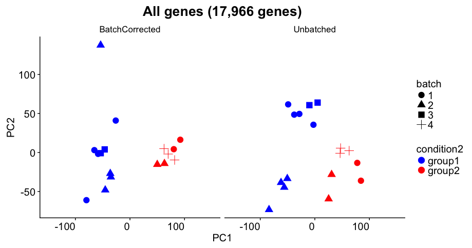

---
# Please do not edit this file directly; it is auto generated.
# Instead, please edit 07-CounttableEDA.md in _episodes_rmd/
title: "Exploratory data analysis of a count table"
author: "Darya Vanichkina"
date: "21/03/2019"
output: html_document
---


Now that we've identified that the library was generated in a strand-specific manner, we can drop the irrelevant ("unstranded", "forwardstrand") columns of our `counttablefull` dataframe. Check that we have 13 columns in the resulting dataframe (12 count, 1 gene name).


~~~
counttablefull <- counttablefull %>% 
  select(-ends_with("unstranded"), -ends_with("forwardstrand")) 
names(counttablefull) <- str_replace(names(counttablefull), "_reversestrand", "")

dim(counttablefull)
~~~
{: .language-r}


~~~
[1] 58780    13
~~~
{: .output}


Lets visualise the count data:


~~~
counttablefull %>%
  select(-ensembl_gene) %>%
  gather(library, value) %>%
  ggplot(aes(x = value)) + geom_histogram(bins = 100) + facet_wrap(~library)
~~~
{: .language-r}


We can clearly see that BY FAR most genes have NO counts. Let's filter these out first, and visualise again:


~~~
counttablefull %>%
  select(-ensembl_gene) %>%
  gather(library, value) %>%
  filter(value > 0) %>% 
  ggplot(aes(x = value)) + geom_density() + facet_wrap(~library) 
~~~
{: .language-r}


We still see that most genes have very low counts. One way to visualise this better is to log-transform the x-axis:


~~~
counttablefull %>%
  select(-ensembl_gene) %>%
  gather(library, value) %>%
  filter(value > 0) %>% 
  ggplot(aes(x = value)) + geom_density() + facet_wrap(~library) + scale_x_log10()
~~~
{: .language-r}


This allows us to see that for most datasets, there are many genes that have ~10 counts each, and ~100 counts, as well as some genes with very low, and some genes with very high counts.


> ## Challenge 1
>
> Use ggplot to make a boxplot of the data above. Is the median number of in each sample what you thought
> it might be based on the density plots above?
>
> 
> {: .source}
>
> > ## Solution
> > 
> > ~~~
> > counttablefull %>%
> >   select(-ensembl_gene) %>%
> >   gather(library, value) %>%
> >   filter(value > 0) %>% 
> >   ggplot(aes(y = value)) + geom_boxplot() + facet_wrap(~library) 
> > 
> > ~~~
> > 
> > {: .output}
> {: .solution}
{: .challenge}

Genes with very low expression levels:

1. Are impossible to accurately assess for differential expression
2. Add to the multiple testing burden, thereby reducing the power to detect truly differentially expressed genes

## Filtering out lowly expressed genes

We will use the `cpm()` function from the `edgeR` library to filter out lowly expressed genes. CPM stands for counts per million, and allows us to normalise for the very different library depths characteristic of our datasets.


~~~
# best to convert to a matrix, as edgeR expects a matrix of counts or a DGEList object as input
counttablematrix <- counttablefull %>%
  select(-ensembl_gene) %>%
  as.matrix()

row.names(counttablematrix) <- counttablefull$ensembl_gene
counttable_cpm <- cpm(counttablematrix)

head(counttable_cpm)
~~~
{: .language-r}


~~~
                  input29b_1 input29b_2 input29b_3 inputscram_1
ENSG00000223972.5 0.00000000   0.000000   0.000000     0.000000
ENSG00000227232.5 0.89137020   1.474682   1.968631     2.965814
ENSG00000278267.1 0.00000000   0.000000   0.000000     0.000000
ENSG00000243485.5 0.09904113   0.000000   0.000000     0.000000
ENSG00000284332.1 0.00000000   0.000000   0.000000     0.000000
ENSG00000237613.2 0.00000000   0.000000   0.000000     0.000000
                  inputscram_2 inputscram_3 pull29b_1 pull29b_2  pull29b_3
ENSG00000223972.5     0.000000     0.000000 0.0000000 0.0000000 0.05728526
ENSG00000227232.5     3.453934     3.517655 0.2293199 0.4191681 0.28642629
ENSG00000278267.1     0.000000     0.000000 0.0000000 0.0000000 0.00000000
ENSG00000243485.5     0.000000     0.000000 0.0000000 0.0000000 0.00000000
ENSG00000284332.1     0.000000     0.000000 0.0000000 0.0000000 0.00000000
ENSG00000237613.2     0.000000     0.000000 0.0000000 0.0000000 0.00000000
                  pullscram_1 pullscram_2 pullscram_3
ENSG00000223972.5  0.09678162  0.03468246   0.0000000
ENSG00000227232.5  0.29034487  0.48555444   0.5395529
ENSG00000278267.1  0.00000000  0.00000000   0.0000000
ENSG00000243485.5  0.00000000  0.00000000   0.0000000
ENSG00000284332.1  0.00000000  0.00000000   0.0000000
ENSG00000237613.2  0.00000000  0.00000000   0.0000000
~~~
{: .output}


As a good rule of thumb, we want to filter out genes that have counts less than 10-15 reads in our raw data. 

Let's figure out how many reads that would be given our library depth. Also, since we're looking at a pulldown experiment, it makes sense for us to develop this cutoff on the input samples (!):


~~~
counttablefull %>%
  select(-ensembl_gene) %>%
  purrr::modify(~sum(.)) %>% 
  distinct() %>%
  gather(library, counts) %>%  # split library column into dataset and protocol
  mutate(millionreads = counts/(10^6)) %>%
  mutate(cpmThreshold = 15/millionreads) %>%
  filter(str_detect(library, 'input')) %>%
  mutate(mycutoff = 0.6 * millionreads)
~~~
{: .language-r}


~~~
       library   counts millionreads cpmThreshold  mycutoff
1   input29b_1 20193630     20.19363    0.7428085 12.116178
2   input29b_2 28480715     28.48072    0.5266722 17.088429
3   input29b_3 23366497     23.36650    0.6419447 14.019898
4 inputscram_1 16521603     16.52160    0.9079022  9.912962
5 inputscram_2 15634347     15.63435    0.9594261  9.380608
6 inputscram_3 15066857     15.06686    0.9955626  9.040114
~~~
{: .output}

A cutoff of 0.6 seems reasonable.


Let's generate a matrix with which we can subset the cpm matrix, which will have a value of TRUE for which at least 3 samples meet the required criteria:


~~~
subsetting_matrix <- counttable_cpm > 0.6
head(subsetting_matrix)
~~~
{: .language-r}


~~~
                  input29b_1 input29b_2 input29b_3 inputscram_1
ENSG00000223972.5      FALSE      FALSE      FALSE        FALSE
ENSG00000227232.5       TRUE       TRUE       TRUE         TRUE
ENSG00000278267.1      FALSE      FALSE      FALSE        FALSE
ENSG00000243485.5      FALSE      FALSE      FALSE        FALSE
ENSG00000284332.1      FALSE      FALSE      FALSE        FALSE
ENSG00000237613.2      FALSE      FALSE      FALSE        FALSE
                  inputscram_2 inputscram_3 pull29b_1 pull29b_2 pull29b_3
ENSG00000223972.5        FALSE        FALSE     FALSE     FALSE     FALSE
ENSG00000227232.5         TRUE         TRUE     FALSE     FALSE     FALSE
ENSG00000278267.1        FALSE        FALSE     FALSE     FALSE     FALSE
ENSG00000243485.5        FALSE        FALSE     FALSE     FALSE     FALSE
ENSG00000284332.1        FALSE        FALSE     FALSE     FALSE     FALSE
ENSG00000237613.2        FALSE        FALSE     FALSE     FALSE     FALSE
                  pullscram_1 pullscram_2 pullscram_3
ENSG00000223972.5       FALSE       FALSE       FALSE
ENSG00000227232.5       FALSE       FALSE       FALSE
ENSG00000278267.1       FALSE       FALSE       FALSE
ENSG00000243485.5       FALSE       FALSE       FALSE
ENSG00000284332.1       FALSE       FALSE       FALSE
ENSG00000237613.2       FALSE       FALSE       FALSE
~~~
{: .output}


~~~
subsetting_vector <- rowSums(subsetting_matrix) >= 3
head(subsetting_vector)
~~~
{: .language-r}


~~~
ENSG00000223972.5 ENSG00000227232.5 ENSG00000278267.1 ENSG00000243485.5 
            FALSE              TRUE             FALSE             FALSE 
ENSG00000284332.1 ENSG00000237613.2 
            FALSE             FALSE 
~~~
{: .output}
We have made a vector with which we can now subset the counttablematrix.


~~~
counttablematrix_filt <- counttablematrix[subsetting_vector,]
dim(counttablematrix_filt)
~~~
{: .language-r}


~~~
[1] 13795    12
~~~
{: .output}

This has resulted in 13795  of 58780 genes remaining for differential expression testing.


<!-- How much of a difference does it make? -->

<!-- ```{r} -->
<!-- # plot a density plot of counttablematrix counts and counttablematrix_filt counts (log_cpm) -->
<!-- ``` -->


We can now convert it to a DGEList object (which stands for a "digital gene expression list"), to enable some critical quality control data analysis and subsequent differential gene expression.

## Convert to DGEList


~~~
mydgelist <- DGEList(counttablematrix_filt)

mydgelist
~~~
{: .language-r}


~~~
An object of class "DGEList"
$counts
                   input29b_1 input29b_2 input29b_3 inputscram_1
ENSG00000227232.5          18         42         46           49
ENSG00000279457.4          26         39         58           25
ENSG00000230021.10          1         22         32            0
ENSG00000225972.1         180        191        298          105
ENSG00000225630.1        3093       8978       5747         1509
                   inputscram_2 inputscram_3 pull29b_1 pull29b_2 pull29b_3
ENSG00000227232.5            54           53        10        18        10
ENSG00000279457.4            16           29        17        23        22
ENSG00000230021.10            0            3        11         9        15
ENSG00000225972.1            45           70       419       322       451
ENSG00000225630.1          1073         1171      5274      5277      4595
                   pullscram_1 pullscram_2 pullscram_3
ENSG00000227232.5            9          14          15
ENSG00000279457.4           25          11          10
ENSG00000230021.10          45          16           2
ENSG00000225972.1          310         408         361
ENSG00000225630.1         5429        5396        5085
13790 more rows ...

$samples
             group lib.size norm.factors
input29b_1       1 20173578            1
input29b_2       1 28455783            1
input29b_3       1 23344076            1
inputscram_1     1 16504464            1
inputscram_2     1 15617845            1
7 more rows ...
~~~
{: .output}


~~~
head(mydgelist$samples)
~~~
{: .language-r}


~~~
             group lib.size norm.factors
input29b_1       1 20173578            1
input29b_2       1 28455783            1
input29b_3       1 23344076            1
inputscram_1     1 16504464            1
inputscram_2     1 15617845            1
inputscram_3     1 15050789            1
~~~
{: .output}

How different are the library depths after filtering?


~~~
mydgelist$samples %>% 
  as.data.frame() %>%
  rownames_to_column() %>%
  separate(rowname, into = c("treatment", "replicate"), sep="_") %>%
  ggplot(aes(y = lib.size, x = treatment, fill = replicate)) +geom_bar(stat = "identity", position = "dodge") 
~~~
{: .language-r}


We can see that there is no substantial difference from our visualisation of the unfiltered data in the previous section.


To visualise whether there is a difference in the distribution of raw counts, we can normalise by library depth to counts per million, and apply a log2 transformation to better see the distribution:


~~~
mydgelist_cpm <- cpm(mydgelist, log = TRUE)
boxplot(mydgelist_cpm)
abline(h=median(mydgelist_cpm),col="blue")
title("Boxplots of logCPMs (unnormalised)")
~~~
{: .language-r}


We can also use ggplot to create a publication-quality version of the above plot:


~~~
mydgelist_cpm %>% 
  as.data.frame() %>%
  rownames_to_column() %>%
  gather(library, log2cpm, -rowname) %>%
  separate(library, into = c("treatment", "replicate"), sep = "_") %>%
  ggplot(aes(x = treatment, y = log2cpm, fill = replicate)) + geom_boxplot() +
  geom_hline(yintercept = median(mydgelist_cpm), lty = 2)
~~~
{: .language-r}


## Essential quality control: most of the variability in your data should be explained by the conditions you are trying to investigate

[Principle components analysis (PCA)](http://www.sthda.com/english/articles/31-principal-component-methods-in-r-practical-guide/118-principal-component-analysis-in-r-prcomp-vs-princomp/) is an approach to dimensionality reduction which aims to identify a combination of the set of variables in your data (in this case: a grouping of many, many genes), which together explain most of the variability in your data. 

In the context of differential expression analysis (or, really, ANY kind of differential RNA analysis), we expect that most of the variability in our data is explained by the conditions we perturbed (i.e treatment vs control, disease vs normal etc). If this is not the case, and distinct samples are grouped together, this indicates that a differential expression analysis is likely to be unreliable, since this analysis specifically looks at the *variance* in the expression of genes in the different libraries.

PCA allows for the unbiased identification of batch effects, which then need to be taken into account in the experimental design, and potentially reveals samples to exclude, if only one or two are "grouping" the wrong way.


~~~
library(factoextra)
~~~
{: .language-r}


~~~
Welcome! Related Books: `Practical Guide To Cluster Analysis in R` at https://goo.gl/13EFCZ
~~~
{: .output}


~~~
res.pca <- prcomp(t(mydgelist_cpm))
colors <- as.factor(str_split(rownames(mydgelist$samples), "_", simplify = TRUE)[,1])
fviz_pca_ind(res.pca,
             col.ind = colors,
             palette = "Set1",
             repel = TRUE,    # Avoid text overlapping
             title = "PCA plot of human data"
             )
~~~
{: .language-r}


We can also generate a "scree" plot, which shows what proportion of variance is explained by each of the components. We can see that PC1 captures by far the most variance.


~~~
fviz_eig(res.pca, addlabels = TRUE)
~~~
{: .language-r}


We can also see that, as is common in most biological experiments (but not other types of data analysis), it's not one gene that contributes strongly to each of the principle components, but many, many genes, that each contribute a tiny bit (< 0.1% !):


~~~
fviz_contrib(res.pca, choice = "var", axes = 1, top = 100)
~~~
{: .language-r}


limma supports the creation of a multidimensional scaling (MDS) plot, which is similar to a [PCA analysis](https://stats.stackexchange.com/questions/14002/whats-the-difference-between-principal-component-analysis-and-multidimensional_). It takes into account only the 500 most variable genes in the dataset.


~~~
plotMDS(mydgelist)
~~~
{: .language-r}


~~~
# We can also add labels and colour to this plot
plotMDS(mydgelist,col= c("red","purple","blue","orange")[colors])
legend("topright",fill=c("red","purple","blue","orange"),legend=levels(colors))
~~~
{: .language-r}


The distance between each pair of samples in the MDS plot is called the "leading fold change": the root-mean-square of the largest 500 log2-fold changes between that pair of samples. In this case, we can see that the distance between the pull_29b samples and the input ones is 

In the MDS plot, the distance between the input samples (approximately -1 on logFC dim 1) and pull29b samples (+2.5) is approximately 3.5 units, which corresponds to a leading fold-change of 2^3.5 = 11.3 between input and specific pulldown. Differences between input and non-specific pulldown (~3 fold) are substantially less.

Reassuringly, all of the input samples group together, indicating that addition of a specific or non-specific oligonucleotide did not substantially affect the RNA sample (i.e. the input is truly an input!).




> ## Challenge 2
>
> The panel above shows the experimental results from [a Bioconductor support question](https://support.bioconductor.org/p/111491/). 
> Imagine that this was the PCA plot you got in one of your experiments.
>
>
> Assume that:
> - you observe this result on your highly expressed genes (not all genes)
> - condition (color) is what you care about
> - batch (shape) indicates the days on which you did the experiment
>
> 1. Do you think there is a batch efect in the data? 
> 2. The author has carried out batch correction. Do you think it was accurate?
> 3. Do you think the differential expression will be accurate in this sample?
> 4. If this was the PCA you observed, what would you do next?
>
> 
>
{: .challenge}


## Heatmaps of the most variable genes

Another helpful visualisation that can assist with understanding the relationship between sequenced datasets uses heirarchical clustering, another unsupervised learning technique. It is designed to group together "more similar" samples based on a distance metric, calculated in n-dimensional space. 

In our case, every sample (i.e. library) is captured in the n-dimensional (13795-dimensional!) space, where very gene is a dimension! /Talk about the need for dimensionality reduction!/


First, we need to generate a dataframe of most variable genes. 


~~~
most_var_genes <- sort(apply(mydgelist_cpm, 1, var), decreasing=TRUE)[1:500]
mydgelist_cpm_most_var <- mydgelist_cpm[most_var_genes,] 
~~~
{: .language-r}

Use the pheatmap library to visualise:


~~~
library(pheatmap)
~~~
{: .language-r}


~~~
Warning: package 'pheatmap' was built under R version 3.5.2
~~~
{: .error}


~~~
pheatmap(mydgelist_cpm_most_var, show_rownames  = FALSE) # hiding rownames as there are 500 undreadable ones
~~~
{: .language-r}


Calclulate a z-score instead of colouring by log2 expression level:


~~~
my_z_score <- function(x){
  return( (x - mean(x)) / sd(x))
}

mydgelist_cpm_most_var2 <-  t(apply(mydgelist_cpm_most_var, 1, my_z_score))
pheatmap(mydgelist_cpm_most_var2, show_rownames  = FALSE)
~~~
{: .language-r}


> ## Challenge 3
>
> Consider what happens when we use all of the genes. How do the libraries cluster?
>
> 
> {: .source}
>
> > ## Solution
> > 
> > ~~~
> > 
> > mydgelist_cpm2 <-  t(apply(mydgelist_cpm, 1, my_z_score))
> > pheatmap(mydgelist_cpm2, show_rownames  = FALSE)
> > 
> > ~~~
> > 
> > {: .output}
> {: .solution}
{: .challenge}


