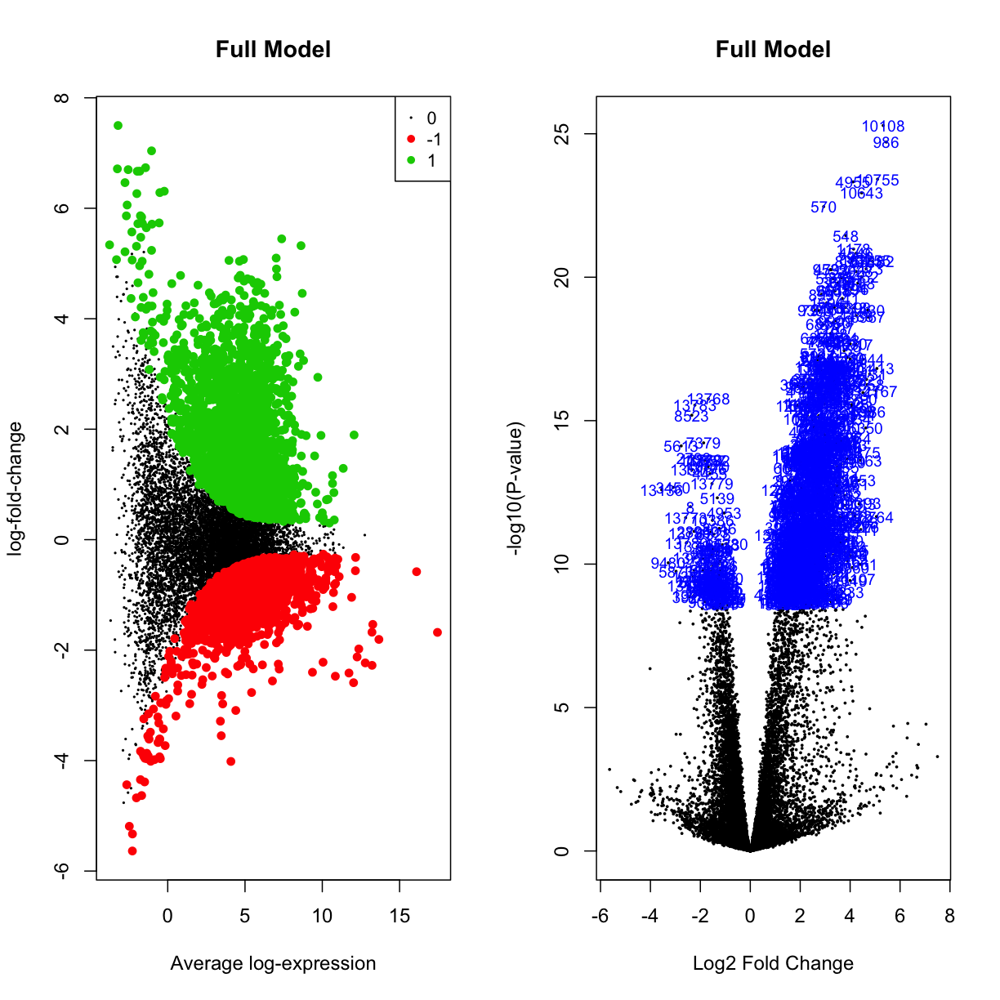

---
# Please do not edit this file directly; it is auto generated.
# Instead, please edit 08-DGEA_limma.md in _episodes_rmd/
title: "Differential gene expression analysis"
author: "Darya Vanichkina"
date: "25/03/2019"
output: html_document
exercises: 20
keypoints: 
- In this section, we have carried out differential gene expression analysis
- We can use both built-in visualisations with limma, as well as external R packages
objectives: 
- Carry out DGEA
questions: 
- How can we carry out DGEA on a count table
- How can we make volcano plots and venn diagrams in R?
- How do we annotate our count table?
- How can we make publication-quality graphics?
source: Rmd
start: 0
teaching: 30
---


## DGEA

Let's normalise for composition bias:


~~~
mydgelist$samples$norm.factors
~~~
{: .language-r}


~~~
 [1] 1 1 1 1 1 1 1 1 1 1 1 1
~~~
{: .output}


~~~
mydgelist <- calcNormFactors(mydgelist)
mydgelist$samples$norm.factors
~~~
{: .language-r}


~~~
 [1] 1.0457882 1.0175851 1.0170688 1.0848988 1.0922646 1.0891243 0.9917884
 [8] 0.9407543 0.9864227 0.9049011 0.9292592 0.9250056
~~~
{: .output}

Next, we need to set up a contrast matrix (table of comparisons) for our differential expression. The colors matrix we used in the last session actually reveals the grouping of our samples. Let's rename it group, and set up a model matrix:


~~~
group <- colors
design <- model.matrix(~ 0 + group)
design
~~~
{: .language-r}


~~~
   groupinput29b groupinputscram grouppull29b grouppullscram
1              1               0            0              0
2              1               0            0              0
3              1               0            0              0
4              0               1            0              0
5              0               1            0              0
6              0               1            0              0
7              0               0            1              0
8              0               0            1              0
9              0               0            1              0
10             0               0            0              1
11             0               0            0              1
12             0               0            0              1
attr(,"assign")
[1] 1 1 1 1
attr(,"contrasts")
attr(,"contrasts")$group
[1] "contr.treatment"
~~~
{: .output}


~~~
colnames(design) <- levels(group)
design
~~~
{: .language-r}


~~~
   input29b inputscram pull29b pullscram
1         1          0       0         0
2         1          0       0         0
3         1          0       0         0
4         0          1       0         0
5         0          1       0         0
6         0          1       0         0
7         0          0       1         0
8         0          0       1         0
9         0          0       1         0
10        0          0       0         1
11        0          0       0         1
12        0          0       0         1
attr(,"assign")
[1] 1 1 1 1
attr(,"contrasts")
attr(,"contrasts")$group
[1] "contr.treatment"
~~~
{: .output}

Use voom to transform the data:


~~~
mydgelist_voomed <- voom(mydgelist,design,plot = TRUE)
~~~
{: .language-r}


> ## Challenge 1
>
> Explore the mydgelist_voomed object. What is in each of the slots?
> 
{: .challenge}


Now let's (finally!) carry out the differential expression:

1. Fit the linear model:


~~~
# Fit the linear model
mydgelist_fit <- lmFit(mydgelist_voomed)
~~~
{: .language-r}

2. Set up the contrast matrix:


~~~
# set up the contrast matrix
contrast_matrix <- makeContrasts(SpecificOligo = pull29b - input29b,
                             ScrambledOligo = pullscram - inputscram,
                             InputDiff = input29b - inputscram,
                             FullModel = (pull29b - input29b) - (pullscram - inputscram),
                             levels=design)

contrast_matrix
~~~
{: .language-r}


~~~
            Contrasts
Levels       SpecificOligo ScrambledOligo InputDiff FullModel
  input29b              -1              0         1        -1
  inputscram             0             -1        -1         1
  pull29b                1              0         0         1
  pullscram              0              1         0        -1
~~~
{: .output}


3. Apply the contrasts matrix to the fit object


~~~
mydgelist_fit_contrasts <- contrasts.fit(mydgelist_fit, contrast_matrix)
~~~
{: .language-r}

4. Perform empirical Bayes shrinkage on the variances, and estimate moderated t-statistics and adjusted p-values


~~~
mydgelist_fit_contrasts<- eBayes(mydgelist_fit_contrasts)
~~~
{: .language-r}

How many differentially expressed genes?


~~~
mydgelist_de <- decideTests(mydgelist_fit_contrasts)
summary(mydgelist_de)
~~~
{: .language-r}


~~~
       SpecificOligo ScrambledOligo InputDiff FullModel
Down            4401           4045      1995      2434
NotSig          4865           5460      9730      8773
Up              4529           4290      2070      2588
~~~
{: .output}


## Venn diagrams

Use limma's `vennDiagram` function to explore how many genes are up/down regulated in each of the comparisons

~~~
vennDiagram(mydgelist_de,
            include=c("up", "down"),
            counts.col=c("red", "blue"),
            circle.col = c("red", "blue", "green3", "orange"))
~~~
{: .language-r}


While many researchers stop at this point, it is actually beneficial to filter simultaneously based on logFC (remember that we don't have too many replicates in this experiment!) and adjusted p-value at the same time, and recalculate the moderated t-statistic and p-values on this filtered subset. We can use the `treat()` command to do this.


~~~
mydgelist_treat <- treat(mydgelist_fit_contrasts,lfc=1)
mydgelist_de_treat <- decideTests(mydgelist_treat)
summary(mydgelist_de_treat)
~~~
{: .language-r}


~~~
       SpecificOligo ScrambledOligo InputDiff FullModel
Down            1141            858         1       104
NotSig         10728          12363     13783     12738
Up              1926            574        11       953
~~~
{: .output}

> ## Challenge 2
>
> Plot a venn diagram of the results. Do you think using treat changed the results?
> What issues did the logFC filtering address? Which of the contrasts ("bins" in the venn) would you consider as "positive hits"?
> 
> {: .source}
>
> > ## Solution
> > 
> > ~~~
> > vennDiagram(mydgelist_de_treat,
> >           include=c("up", "down"),
> >           counts.col=c("red", "blue"),
> >            circle.col = c("red", "blue", "green3", "orange"))
> > ~~~
> > 
> > {: .output}
> {: .solution}
{: .challenge}

## Volcano plots

Another visualisation that can help us understand what is going on in our data is the volcano plot, which plots the logFC of genes along the x-axis, the -log10(adjusted-p-value) on the y-axis, and colours the DE points accordingly. Let's have a look at the volcano plots of our data (both "treated" and not):


~~~
par(mfrow=c(1,2))
plotMD(mydgelist_fit_contrasts,column = 1,status=mydgelist_de[,"SpecificOligo"], values = c(-1, 1), main = "SpecificOligo")
volcanoplot(mydgelist_fit_contrasts,coef = 1,highlight=800, main = "SpecificOligo")
~~~
{: .language-r}


~~~
par(mfrow=c(1,2))
plotMD(mydgelist_fit_contrasts,column = 2,status=mydgelist_de[,"ScrambledOligo"], values = c(-1, 1), main = "ScrambledOligo")
volcanoplot(mydgelist_fit_contrasts,coef = 2,highlight=800, main = "ScrambledOligo")
~~~
{: .language-r}


~~~
par(mfrow=c(1,2))
plotMD(mydgelist_fit_contrasts,column = 3,status=mydgelist_de[,"InputDiff"], values = c(-1, 1), main = "InputDiff")
volcanoplot(mydgelist_fit_contrasts,coef = 3,highlight=800, main = "InputDiff")
~~~
{: .language-r}


~~~
par(mfrow=c(1,2))
plotMD(mydgelist_fit_contrasts,column = 4,status=mydgelist_de[,"FullModel"], values = c(-1, 1), main = "Full Model")
volcanoplot(mydgelist_fit_contrasts,coef = 4,highlight=800, main = "Full Model")
~~~
{: .language-r}




> ## Challenge 3
>
> Plot the same for the treated contrasts. What do you think this result means?
>
> 
> {: .source}
>
> > ## Solution
> > 
> > ~~~
> >
> > par(mfrow=c(1,2))
> > plotMD(mydgelist_treat,column = 1,status=mydgelist_de_treat[,"SpecificOligo"], values = c(-1, 1), main = "SpecificOligo")
> > volcanoplot(mydgelist_treat,coef = 1,highlight=800, main = "SpecificOligo")
> > 
> > par(mfrow=c(1,2))
> > plotMD(mydgelist_treat,column = 2,status=mydgelist_de_treat[,"ScrambledOligo"], values = c(-1, 1), main = "ScrambledOligo")
> > volcanoplot(mydgelist_treat,coef = 2,highlight=800, main = "ScrambledOligo")
> > 
> > par(mfrow=c(1,2))
> > plotMD(mydgelist_treat,column = 3,status=mydgelist_de_treat[,"InputDiff"], values = c(-1, 1), main = "InputDiff")
> > volcanoplot(mydgelist_treat,coef = 3,highlight=6, main = "InputDiff")
> > 
> > 
> > 
> > par(mfrow=c(1,2))
> > plotMD(mydgelist_treat,column = 4,status=mydgelist_de_treat[,"FullModel"], values = c(-1, 1), main = "Full Model")
> > volcanoplot(mydgelist_treat,coef = 4,highlight=800, main = "Full Model")
> > 
> > ~~~
> > 
> > {: .output}
> {: .solution}
{: .challenge}


## Annotate the list of differentially expressed genes

### Get a dataframe of differentially expressed genes

Let's get a data frame of differentially expressed genes for our fourth comparison ("Full Model"), from the "treat" approach:


~~~
final_DGEA_df <- topTreat(mydgelist_treat, coef = 4, n="Inf") %>% rownames_to_column()  %>% dplyr::rename(gene = rowname)
final_DGEA_df$significant <- final_DGEA_df$adj.P.Val <= 0.05
# use the table command to verify that the above matches the output in the venn diagram :) 
table(final_DGEA_df$significant)
~~~
{: .language-r}


~~~

FALSE  TRUE 
12738  1057 
~~~
{: .output}


~~~
# need to remove decimal point after gene id
final_DGEA_df <- final_DGEA_df %>% separate(gene, into=c("gene", "version"), sep = "\\.")
~~~
{: .language-r}

### Annotate those ENSGs!

While gencode/ENSEMBL gene identifiers are wonderful in their consistency and ease of tracking between different gencode releases, they are not exactly human-readable. For example, ENSG00000138336.8 is among the most strongly enriched genes in the datasets... but that really doesn't mean anything unless we map it back to the human-readable TET1, and reassuringly reveal that [it's a known miR-29b binding partner in mice](https://www.ncbi.nlm.nih.gov/pubmed/27449105)!

In order to do this, we can use the biomaRt application programming interface (API), which will query the ensembl biomaRt database:


~~~
ensembl <-  useDataset("hsapiens_gene_ensembl",mart=useMart("ensembl"))
annotations <- getBM(attributes=c("ensembl_gene_id","hgnc_symbol", "description", "gene_biotype"), 
                     filters = "ensembl_gene_id", 
                     values=final_DGEA_df$gene, 
                     mart=ensembl)
~~~
{: .language-r}


~~~
Batch submitting query [>-------------------------] 5% eta: 21s
Batch submitting query [=>------------------------] 8% eta: 21s
Batch submitting query [==>-----------------------] 10% eta: 21s
Batch submitting query [==>-----------------------] 13% eta: 21s
Batch submitting query [===>----------------------] 15% eta: 19s
Batch submitting query [====>---------------------] 18% eta: 18s
Batch submitting query [====>---------------------] 21% eta: 18s
Batch submitting query [=====>--------------------] 23% eta: 18s
Batch submitting query [======>-------------------] 26% eta: 17s
Batch submitting query [======>-------------------] 28% eta: 16s
Batch submitting query [=======>------------------] 31% eta: 15s
Batch submitting query [========>-----------------] 33% eta: 14s
Batch submitting query [========>-----------------] 36% eta: 14s
Batch submitting query [=========>----------------] 38% eta: 13s
Batch submitting query [==========>---------------] 41% eta: 12s
Batch submitting query [==========>---------------] 44% eta: 12s
Batch submitting query [===========>--------------] 46% eta: 11s
Batch submitting query [============>-------------] 49% eta: 11s
Batch submitting query [============>-------------] 51% eta: 10s
Batch submitting query [=============>------------] 54% eta: 10s
Batch submitting query [==============>-----------] 56% eta: 9s
Batch submitting query [==============>-----------] 59% eta: 8s
Batch submitting query [===============>----------] 62% eta: 8s
Batch submitting query [================>---------] 64% eta: 7s
Batch submitting query [================>---------] 67% eta: 7s
Batch submitting query [=================>--------] 69% eta: 6s
Batch submitting query [==================>-------] 72% eta: 6s
Batch submitting query [==================>-------] 74% eta: 5s
Batch submitting query [===================>------] 77% eta: 5s
Batch submitting query [====================>-----] 79% eta: 4s
Batch submitting query [====================>-----] 82% eta: 4s
Batch submitting query [=====================>----] 85% eta: 3s
Batch submitting query [======================>---] 87% eta: 3s
Batch submitting query [======================>---] 90% eta: 2s
Batch submitting query [=======================>--] 92% eta: 2s Batch
submitting query [========================>-] 95% eta: 1s Batch submitting
query [========================>-] 97% eta: 1s Batch submitting query
[==========================] 100% eta: 0s
~~~
{: .output}
Now we can use dplyr to join the dataframes:


~~~
final_DGEA_df_anno <- inner_join(final_DGEA_df, annotations, by = c("gene" = "ensembl_gene_id"))
~~~
{: .language-r}

Let's write out 4 dataframes: 

- all genes
- all de genes
- the names of upregulated genes
- the names of downregulated genes


~~~
final_DGEA_df_anno %>% write_csv("finaltables/all_genes.csv")

final_DGEA_df_anno %>%
  filter(final_DGEA_df_anno$significant == TRUE) %>%
  write_csv("finaltables/all_significant_genes.csv")

final_DGEA_df_anno %>%
  filter(final_DGEA_df_anno$significant == TRUE) %>%
  filter(logFC > 0) %>%
  dplyr::select(hgnc_symbol) %>%
  write_tsv("finaltables/upregulated_genes.txt")

final_DGEA_df_anno %>%
  filter(final_DGEA_df_anno$significant == TRUE) %>%
  filter(logFC < 0) %>%
  dplyr::select(hgnc_symbol) %>%
  write_tsv("finaltables/dwregulated_genes.txt")
~~~
{: .language-r}


> ## Challenge 4
>
> What biotype are most of the differentially enriched genes? 
> Make a barplot, split by whether a gene is enriched or depleted, to visualise this
> 
> {: .source}
>
> > ## Solution
> > 
> > ~~~
> > 
> > 
> > final_DGEA_df_anno %>% 
> >   filter(significant == TRUE) %>%
> >   mutate(direction = ifelse(logFC > 0, "Enriched", "Depleted")) %>%
> >   dplyr::select(direction, gene_biotype) %>%
> >   ggplot(aes(x = gene_biotype, fill = gene_biotype)) + geom_bar() 
> >   + facet_grid(direction~., scales = "free_y") + scale_y_log10() 
> >   + theme(axis.text.x = element_text(angle = 90, hjust = 1)) + theme(legend.position="none") 
> > 
> > ~~~
> > 
> > {: .output}
> {: .solution}
{: .challenge}


## Publication-quality volcano plots

While the volcano plots produced by limma are suitable for exploratory data analysis and library investigation, when preparing publication-quality graphics we often want to take advantage of the power of the `ggplot()` library. 

Let's use `ggplot()` to craft our own volcano plot.


~~~
base_volcano <- final_DGEA_df_anno %>% # select gene name (hgnc), logFC, adjPvalue and the T/F for whether the DE was significant
  dplyr::select(logFC, adj.P.Val, significant, hgnc_symbol) %>%
  ggplot(aes(x = logFC, y = -log10(adj.P.Val), col = significant)) + geom_point() + scale_color_brewer(palette = "Set2") + theme(legend.position="none")
base_volcano
~~~
{: .language-r}


Label the top 15 genes by adjusted p-value.


~~~
colorMeVolcano <-
  final_DGEA_df_anno %>% # select gene name (hgnc), logFC, adjPvalue and the T/F for whether the DE was significant
  dplyr::select(logFC, adj.P.Val, significant, hgnc_symbol) %>%
  filter(significant == TRUE) %>%
  arrange(adj.P.Val) %>%
  head(15L)
~~~
{: .language-r}


Use ggrepel to ensure the labels don't overlap.


~~~
library(ggrepel)
base_volcano  + geom_text_repel(data = colorMeVolcano, aes(x = logFC, y = -log10(adj.P.Val), label = hgnc_symbol),  col = "black") + 
  geom_point(data = colorMeVolcano, aes(x = logFC, y = -log10(adj.P.Val)),  col = "black", pch = 1, size = 3)
~~~
{: .language-r}


<!-- ```{r} -->
<!-- Add glimma -->
<!-- group2 <- group -->
<!-- levels(group2) <- c("basal.lactate","basal.preg","basal.virgin","lum.lactate", "lum.p -->
<!-- reg", "lum.virgin") -->
<!-- glXYPlot(x=fit.cont$coefficients[,1], y=fit.cont$lods[,1], -->
<!--          xlab="logFC", ylab="B", main="B.PregVsLac", -->
<!--          counts=y$counts, groups=group2, status=summa.fit[,1], -->
<!--          anno=fit.cont$genes, side.main="ENTREZID", folder="volcano") -->
<!-- ``` -->


