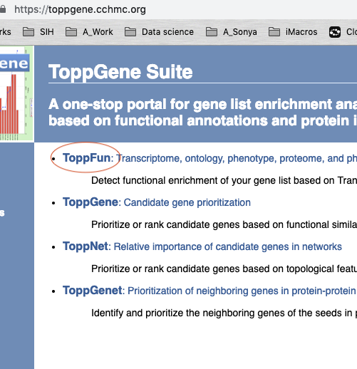
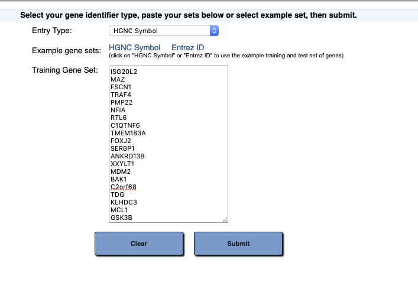
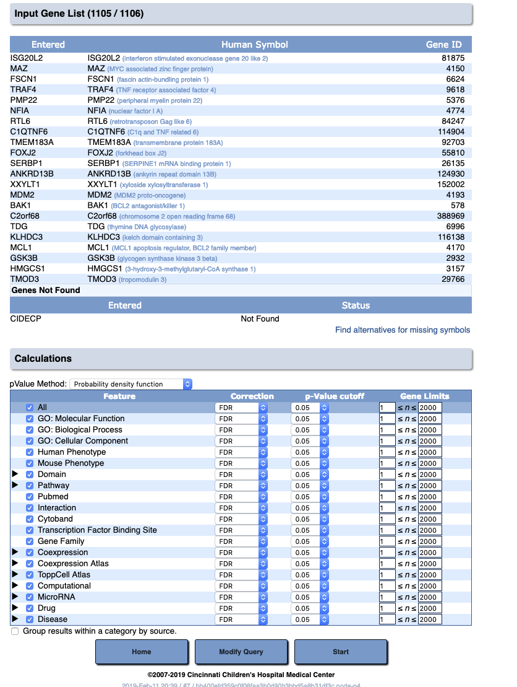
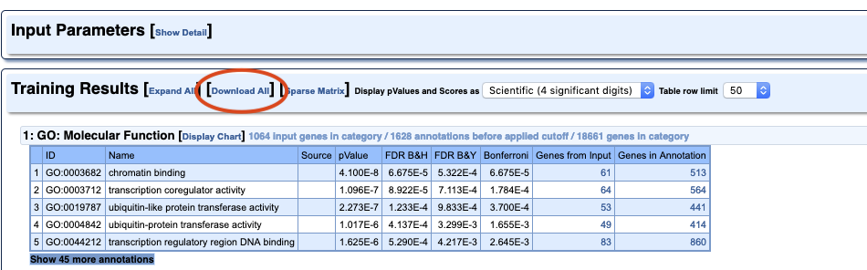
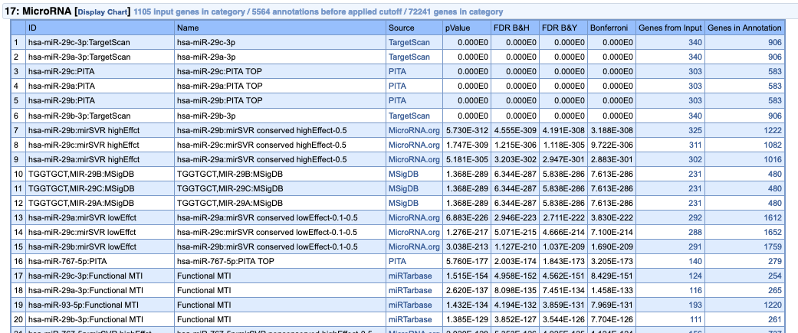
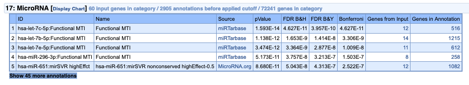

---
# Please do not edit this file directly; it is auto generated.
# Instead, please edit 09-ToppGeneGO.md in _episodes_rmd/
title: "Basic pathway analysis using ToppGene"
author: "Darya Vanichkina"
date: "25/03/2019"
output: html_document
exercises: 10
keypoints: 
- Exploratory pathway analysis can be performed using a wide range of online tools
- ToppGene allows us to quickly assess what's going on in our data
- If a formal pathway analysis needs to be carried out, tools like goana and camera nicely fit within the limma ecosystem
objectives: 
- Quickly assess whether our experiment worked, i.e. was able to enrich for miR29b targets
- Introduce ToppGene and interpret it's output
- Mention other approaches to pathway analysis
questions: 
- How do we quickly assess what the gene list we obtained actually means?
- What online tools can we use for pathway analysis? 
- What are the limitations of online pathway analysis tools?
source: Rmd
start: 0
teaching: 30
---

The most basic approach to pathway analysis of RNA-seq data involves:

1. Calculating overlaps between the list of differentially expressed genes and the list of genes annotated to a specific pathway
2. Adjusting for number of genes in each
3. Calculating a statistic that reflects how likely it is that this number of genes from this pathway was observed by chance vs is meaningful, and adjusting for multiple comparisons

We will use ToppGene as a first-pass tool to explore our data.

1. Go to [the ToppGene website](https://toppgene.cchmc.org/)

2. Enter the list of upregulated genes (their HGNC ids)

3. Run the analysis

4. You can either explore the data online, and/or download the analysis results as a text file.

> ## Challenge 1
>
> Which of the results do you think are most important for this experiment? 
> Do you think the experiment worked?
> 
> {: .source}
>
> > ## Solution
> > 
> > 
> > 
> > {: .output}
> {: .solution}
{: .challenge}

~~~
toppgene_upreg <- read_tsv("finaltables/toppgeneresults_upregulated.txt")
~~~
{: .language-r}

~~~
Error in read_tsv("finaltables/toppgeneresults_upregulated.txt"): could not find function "read_tsv"
~~~
{: .error}

~~~
toppgene_upreg %>% 
  dplyr::filter(Category == "MicroRNA") %>% 
  mutate(proportion_detected = `Hit Count in Query List`/`Hit Count in Genome`) %>%
  dplyr::select(ID, proportion_detected) %>%
  head(n = 20L) %>%
  ggplot(aes(y= proportion_detected, x = ID, fill = ID)) + geom_bar(stat = "identity") + coord_flip() + theme(legend.position="none") 
~~~
{: .language-r}

~~~
Error in toppgene_upreg %>% dplyr::filter(Category == "MicroRNA") %>% : could not find function "%>%"
~~~
{: .error}

If we were preparing this for publication, we could further filter the list of genes annotated as targets to only include genes expressed in our study.

If we run the analysis on the "depleted" genes, no such result is observed, and very few miRNA targets are detected.

Note that more advanced and appropriate tools to carry out pathway analysis, including:

- goana: takes into account gene length bias; tests for molecular function, biological process and cellular component
- CAMERA: tests using the Broad's MSigDB
- specialised tools for miRNA analysis
- IPA/GeneGo MetaCore

