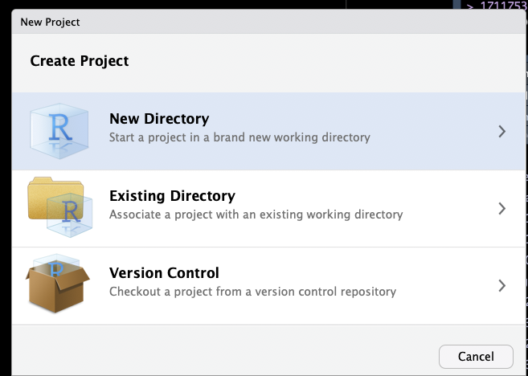
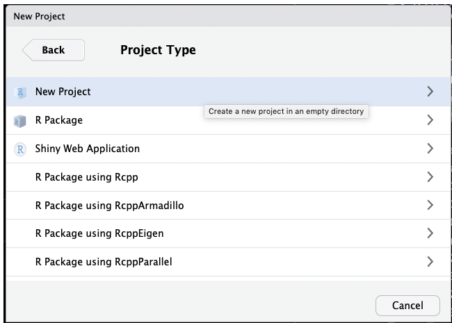
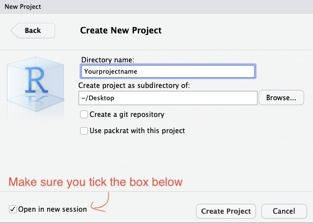

```{r setup, include=FALSE}
source("../bin/chunk-options.R")
knitr_fig_path("06-")

library(tidyverse)
theme_set(theme_minimal())

```


<!-- FIXME add 04-bamqc.Rmd and 05-visualisation_in_genome_browser.Rmd  -->

The STAR-generated count table is called `DATASETNAME_ReadsPerGene.out.tab`. We can download it from our HPC server, load it into R, and explore it using standard R libraries.

## Set up an RStudio project for our work

First, create an R project using RStudio, by selecting `File -> New Project...` from the menu. Then follow the screenshots below:








This will set up an RStudio project in a new directory called Yourprojectname on the Desktop of your machine, and launch a new session of R in Rstudio. Your screen should look something like this:


For purposes of this training, create a new R file by using the `File->New File -> Rscript` command. If you are more comfortable with R and RStudio, we highly recommend you use [Rmarkdown](https://rmarkdown.rstudio.com/) instead, in which case create an R Notebook or an RMarkdown document. 


After you have created a new Rscript, you should see something that looks like this:


## Get the count table data

### If starting the workshop at this point

1. Make a data folder
2. Download and unarchive the following [archive](https://figshare.com/articles/Counttables/7886549).

```{r loadData}
library(tidyverse)
files <- dir(path = "data", pattern = "*.tab", full.names = T) 

counttablefull <- files %>%
  map(read_tsv,  skip = 4, col_names = FALSE ) %>%
  reduce(cbind) 
```

We can see that the data has been loaded in, but the column names are not capturing the dataset name.

```{r showFirstFew}
counttablefull %>% head()
```

To fix this, we can do the following:

```{r fixColNames}
datasets <-
  files %>%
  stringr::str_replace("data/", "") %>% # replace data/ at the beginning of filename
  stringr::str_replace("ReadsPerGene.out.tab", "") # replace ReadsPerGene.out.tab end of name
datasets

columnnames <- c()
for (i in datasets) {
  columnnames <- c(columnnames,
                  paste0("gene_", i),
                  paste0(i, "_unstranded"),
                  paste0(i, "_forwardstrand"),
                  paste0(i, "_reversestrand")
  )
}

names(counttablefull) <- columnnames
rm(columnnames, datasets)
```

Make a column for the gene identifier, and remove duplicate gene id information:

```{r cleanDupCols}
counttablefull <- counttablefull %>%
  mutate(ensembl_gene =gene_input29b_1) %>%
  select(-starts_with("gene"))

counttablefull %>% head()
```

Unlike other tools (htseq-count, featureCounts), STAR does not require us to specify whether the RNA-seq library was generated in a strand-specific manner, and, if so, which strand was retained in the final sequencing. Instead, it provides 3 counts per library:

- as if the library was unstranded
- if the library was stranded "forward", i.e. the second cDNA strand was the one sequenced, i.e. it is the same as the original mRNA sample 
- if the library was stranded "reverse", i.e. the first cDNA strand is the one sequenced, so its sequence is the complement of the original mRNA


If we have a stranded library, we can add up the number of counts to genes in each of the libraries as a "sanity check", to ensure that the stranding "worked" and not too much antisense transcription was detected.


```{r ExploreStranding}

counttablefull %>% # remove gene name column
  select(-ensembl_gene) %>% # find column sum
  summarise_each(funs(sum)) %>%  # gather wide data (columns) into a long table
  gather(library, counts) %>% # split library column into dataset and protocol 
  separate(library, into = c("treatment", "replicate", "stranding"), sep="_") %>% # split library into 3 columns
  spread(stranding,counts) %>% # make columns for each of the strandings
  mutate(propF = forwardstrand/unstranded, propR = reversestrand/unstranded) # assess rev/unst and for/unst

```


> ## Challenge
>
> 1. Do you think the library was generated in a strand-specific manner?
> 2. If yes, which one?
> 3. Why do you think propR > 1? What does this mean, and why does it happen?
>
>
>
> {: .source}
>
> > ## Solution
> > 
> > 1. Yes
> > 2. "reversestrand". It was actually generated using the Illumina TruSeq protocol, 
> > which uses dUTP incorporation to ensure strand-specific library synthensis. 
> > 3. The fact that more reads unambiguously overlap with genes using the
> > "reverse" approach indicates that (1) our stranding protocol most likely worked
> > (note!: this is not a robust way of "testing for" this, for which we would instead
> > use a tool like infer_stranding.py from the [rseqc software](http://rseqc.sourceforge.net/)),
> > and that (2) using a protocol that retains strand information was useful to any 
> > downstream analyses that we might want to do, including differential gene expression analysis.
> > The reason the count of reads overlapping in a strand-specific manner is higher than in an
> > unstranded manner is that the human genome has many antisense transcripts, and any read that falls into a 
> > genomic region that contains an overlap of sense and antisense transcripts will not be able to be
> > unambiguously assigned with a protocol where the strand is unknown. 
> > 
> > {: .output}
> {: .solution}
{: .challenge}


Let's take a moment to assess whether the library depth is similar for all of our samples. In this case, we consider the library depth to be "number of reads counted towards annotated genes in the genome", NOT "number of uniquely mapped reads":

```{r}

counttablefull %>% # remove gene name column
  select(ends_with("reversestrand")) %>%
  summarise_each(funs(sum)) %>%  # gather wide data (columns) into a long table
  gather(library, counts) %>%  # split library column into dataset and protocol
  separate(library, into = c("treatment", "replicate", "stranding"), sep="_") %>%
  select(-stranding) %>%
  ggplot(aes(y = counts, x = treatment, fill = replicate)) +geom_bar(stat = "identity", position = "dodge") 

```


We can see that the number of reads mapping to genes in the pulldowns is approximately 2x that of reads mapping to genes in the input. 

```{r SaveRDS, echo = F}
saveRDS(counttablefull, "processeddata/counttablefull.Rds")
```


<!-- ### If continuing from the Artemis section - FIXME -->

<!-- To download the data from the server, open another terminal window on your machine and enter: -->

<!-- ``` -->
<!-- cd  -->
<!-- scp yourusername@hpc.sydney.edu.au:/project/Training/yourname/star/*ReadsPerGene.out.tab . -->
<!-- ``` -->


